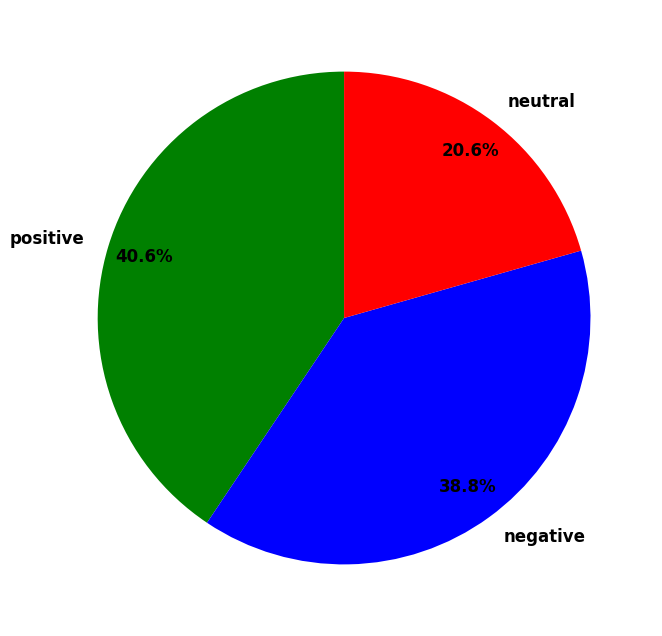

# Sentiment Analysis of Shin Tae-Yong Dismissal Project 🎯

## Overview 📚
This project was created based on the dismissal of Shin Tae Yong as head coach of the Indonesian national football team on Monday, January 6th 2025. This project aims to understand and assess public opinion sentiment on social media x. This project uses the Python Library TextBlob & Natural Language Toolkit, viz, NLTK Sentiment Vader SentimentIntensityAnalyzer.

## Method 🖥️
1. **Data Collection:** Tweet data is collected using the crawl method on social media x. The keywords used for the search were "STY" and "Shin Tae-yong" in the time period Monday, January 6th 2025 to Tuesday, January 7th 2025.
2. **Preprocessing:** The collected text is then combined and cleaned from noise such as URLs, usernames, punctuation, and changing text letters to lowercase. In this process, the text is also translated from Indonesian to English.
3. **Sentiment Analysis:** Sentiment analysis was performed using `TextBlob` and `NLTK VADER` libraries. Sentiment is classified into three categories: positive, negative, and neutral.
4. **Visualization:** The sentiment analysis results are visualized in the form of pie charts and word clouds.

## Installation 🛠️
* `pandas`
* `re`
* `nltk`
* `textblob`
* `googletrans`
* `wordcloud`
* `matplotlib`

## Results 📈
Dari 884 opini yang dikumpulkan pada sosial media x, hasil analisis sentimen menunjukkan bahwa 40.6% (359 twit) opini bersentimen positif, 38.8% (343 twit) opini bersentimen negatif, dan 20.6% (182) bersentimen netral. Adapun visualisasi dari analisis tersebut dapat diamati pada gambar berikut.  

## Kontribusi 🤝
Contributions and suggestions are greatly appreciated. Please submit a pull request if you would like to contribute to this project.

